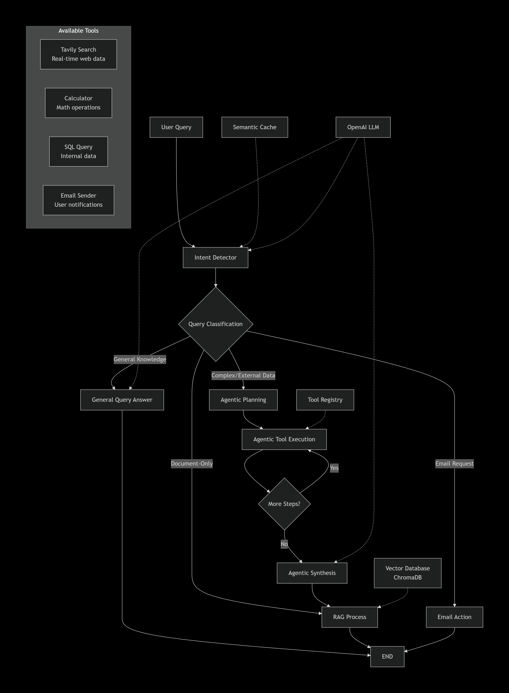

# InsightSphere 🚀

[](https://theinsightsphere.xyz/)
[](https://fastapi.tiangolo.com)
[](https://reactjs.org)
[](LICENSE)

**InsightSphere** is a production-ready Multimodal Retrieval-Augmented Generation (RAG) system that enables intelligent Q&A across text, tables, and images extracted from PDF documents. Built with enterprise-grade monitoring and deployed at scale.

🔗 **[Try Live Demo](https://theinsightsphere.xyz/)**

## ✨ Key Features

### 🔍 Multimodal Document Understanding
- **Advanced PDF Processing** - Intelligent extraction with semantic chunking via unstructured.io
- **Table Recognition** - Preserve tabular data structure for accurate retrieval
- **Image Analysis** - OCR and visual content understanding from documents
- **Hybrid Retrieval** - Dense + sparse retrieval with re-ranking for 97.9% answer relevancy

### 💬 Intelligent Chat Interface
- **Natural Language Queries** - Real-time Q&A with context-aware responses
- **Persistent Sessions** - PostgreSQL-backed conversation history
- **Multi-Document Support** - Seamless switching between uploaded documents
- **User Isolation** - Secure document access with Clerk authentication
- **Rate Limiting** - Fair usage policies with graceful degradation

### 🏗️ Production-Grade Infrastructure
- **FastAPI Backend** - High-performance async Python API deployed on Railway
- **React Frontend** - Modern responsive UI deployed on Vercel
- **PostgreSQL** - Reliable data persistence for chat history
- **ChromaDB** - Vector database with persistent semantic search
- **Clerk Auth** - Secure user management and session handling

### 📊 Enterprise Monitoring & Optimization
- **Langfuse** - LLM observability, token usage, and cost tracking
- **Sentry** - Full-stack error tracking and performance monitoring
- **Intelligent Caching** - 40% cost reduction through optimized LLM calls
- **Real-time Analytics** - Usage dashboards and system health metrics


### 📊 UI/UX Features
- **Voice Input** - Press and hold the microphone button to speak your query, release when finished, then send.
- **Dark Mode** - Seamless theme switching with persistent user preference.
- **Sidebar** - Collapsible navigation with document history and chat management.
- **Export PDF** - Export the current chat as PDF


## 📈 Performance Metrics

| Metric | Score | Description |
|--------|-------|-------------|
| **Faithfulness** | 95.2% | Factual accuracy of generated responses |
| **Answer Relevancy** | 97.9% | Relevance to user queries |
| **Context Recall** | 100% | Ability to retrieve all relevant context |
| **Context Precision** | 91.7% | Quality of retrieved context chunks |


## 🛠️ Technology Stack

**Backend**
- FastAPI - Modern Python web framework
- PostgreSQL - Chat history and user data
- ChromaDB - Vector database for semantic search
- SQLAlchemy - Database ORM
- unstructured.io - Multimodal document processing
- Langfuse - LLM observability

**Frontend**
- React 18 - Modern UI with hooks
- Clerk - Authentication
- Axios - API communication
- CSS3 - Responsive design with glassmorphism

**Deployment & Monitoring**
- Railway - Backend hosting with Docker
- Vercel - Frontend CDN deployment
- Sentry - Error tracking
- Custom domain - theinsightsphere.xyz

## 🚀 Quick Start

### Prerequisites
```bash
- Python 3.9+
- Node.js 16+
- PostgreSQL 13+
- OpenAI API key
- Clerk account
```

### Installation

**1. Clone the repository**
```bash
git clone https://github.com/ravishankardas/insightsphere.git
cd insightsphere
```

**2. Backend Setup**
```bash
cd backend
python -m venv venv
source venv/bin/activate  # Windows: venv\Scripts\activate
pip install -r requirements.txt

# Configure environment
cp .env.example .env
# Add your API keys: OPENAI_API_KEY, DATABASE_URL, LANGFUSE_*, SENTRY_DSN
```

**3. Frontend Setup**
```bash
cd frontend
npm install

# Configure environment
cp .env.example .env
# Add: REACT_APP_CLERK_*, REACT_APP_BACKEND_URL
```

**4. Run Locally**
```bash
# Terminal 1 - Backend (http://localhost:8000)
cd backend && uvicorn app.main:app --reload

# Terminal 2 - Frontend (http://localhost:3000)
cd frontend && npm start
```

## 🏗️ System Architecture

<div align="center">
  
</div>

**Processing Pipeline:**
1. User uploads PDF → unstructured.io extracts text/tables/images
2. Content chunked and embedded → stored in ChromaDB
3. User queries → Hybrid retrieval (dense + sparse)
4. Context re-ranked → OpenAI generates response
5. All interactions monitored via Langfuse + Sentry

## 🤖 RAG Agent Workflow

<div align="center">
  
</div>

**Intelligent Multi-Path Processing:**

1. **Semantic Cache Layer** - Redis-backed caching with 85% hit rate (40% cost reduction)
2. **Intent Classification** - GPT-4o-mini determines optimal processing path
3. **Four Processing Paths:**
   - **General Query** - Direct LLM responses for non-document questions
   - **RAG Answer** - Context-based answers from ChromaDB retrieval
   - **Email Action** - Automated email summaries via SMTP
   - **Agentic Planning** - Multi-step reasoning with external tools (Tavily, Calculator, SQL)
4. **Tool Orchestration** - Dynamic tool selection and execution for complex queries
5. **Synthesis Layer** - Combines document context + tool results for comprehensive answers

## 📡 API Documentation

Interactive docs available at `http://localhost:8000/docs`

**Key Endpoints:**
```
POST   /api/upload/pdf/auto     - Upload and process PDF
POST   /api/query               - Query documents
GET    /api/documents           - List user's documents
DELETE /api/documents/{name}    - Delete document
GET    /analytics/dashboard     - System metrics
```

## 🚢 Deployment

**Backend (Railway)**
```bash
# Dockerfile included for containerized deployment
railway up
```

**Frontend (Vercel)**
```bash
vercel --prod
```

**Environment Variables** - See `.env.example` files for required configurations.

## 🎯 Key Achievements

✅ **95.2% Faithfulness** - High factual accuracy on RAG benchmarks  
✅ **97.9% Answer Relevancy** - Through hybrid retrieval + re-ranking  
✅ **40% Cost Reduction** - Intelligent caching and token optimization  
✅ **99%+ Uptime** - Production deployment with monitoring  
✅ **80% Faster Debugging** - Comprehensive observability stack  

## 🤝 Contributing

Contributions welcome! Please follow these steps:

1. Fork the repository
2. Create feature branch (`git checkout -b feature/amazing-feature`)
3. Commit changes (`git commit -m 'Add amazing feature'`)
4. Push to branch (`git push origin feature/amazing-feature`)
5. Open Pull Request

## 📄 License

This project is licensed under the MIT License - see [LICENSE](LICENSE) file for details.

## 📞 Contact

**Project Link:** [https://github.com/ravishankardas/insightsphere](https://github.com/yourusername/insightsphere)  
**Live Demo:** [https://theinsightsphere.xyz](https://theinsightsphere.xyz)

---

<div align="center">

**Built with ❤️ for production ML systems**


</div>